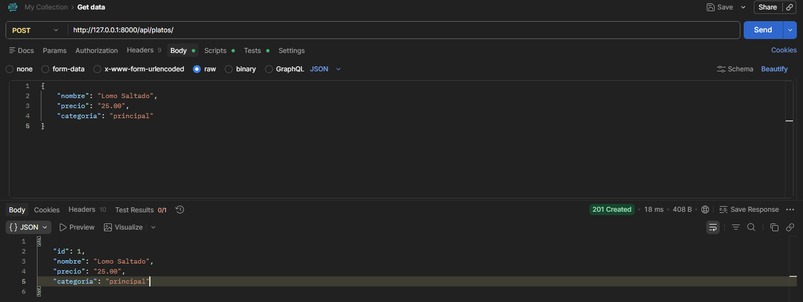
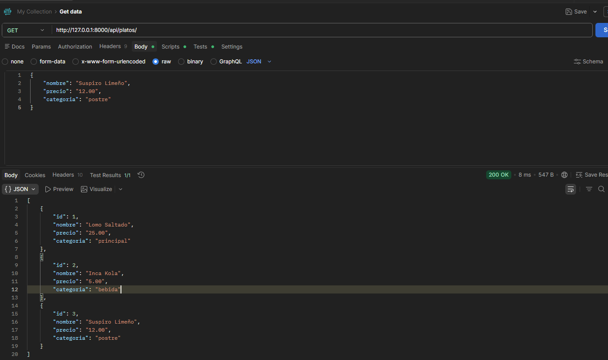
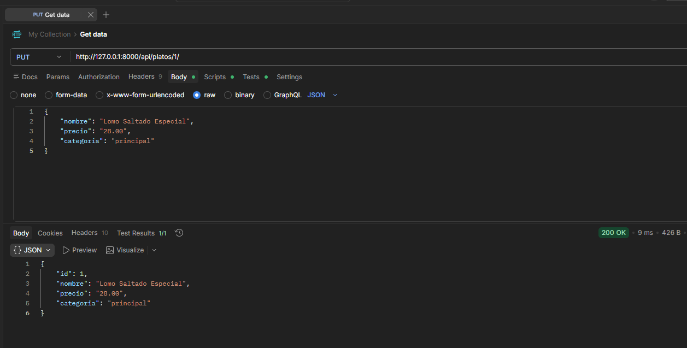
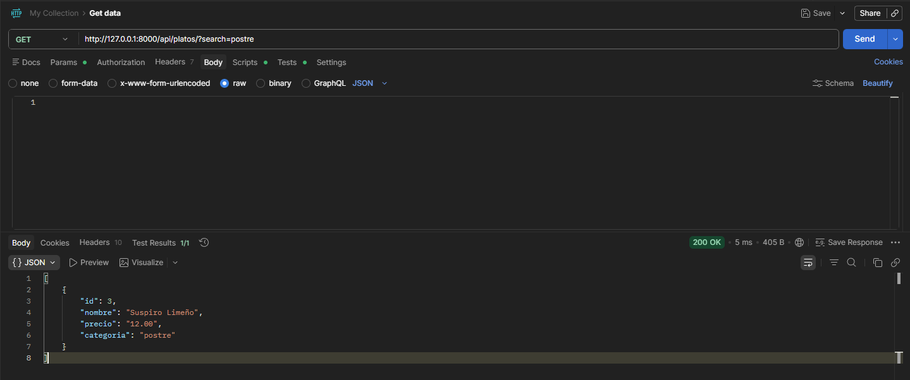
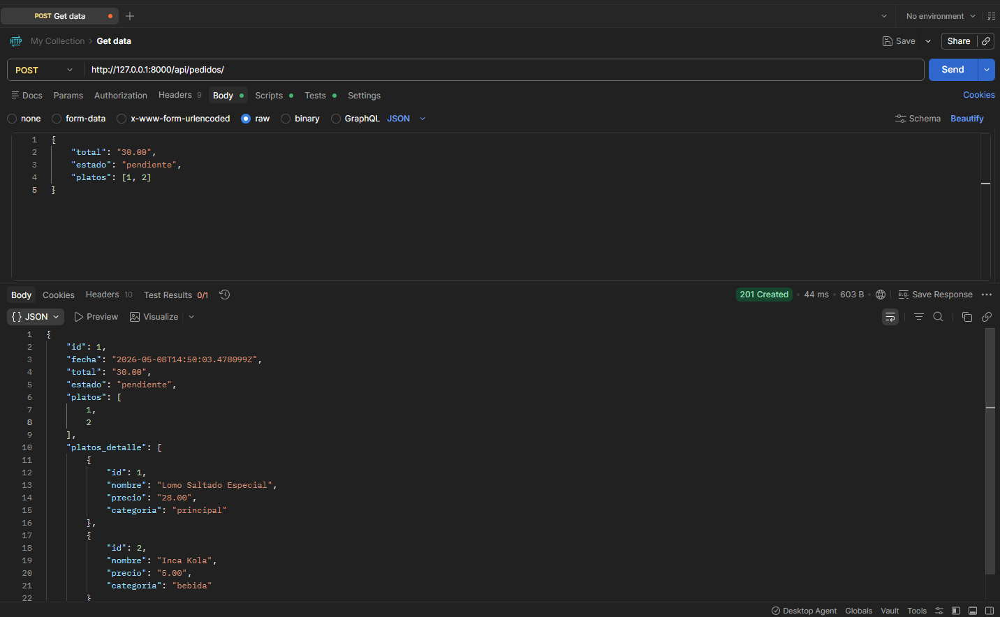
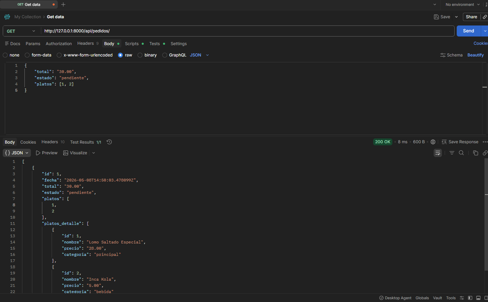
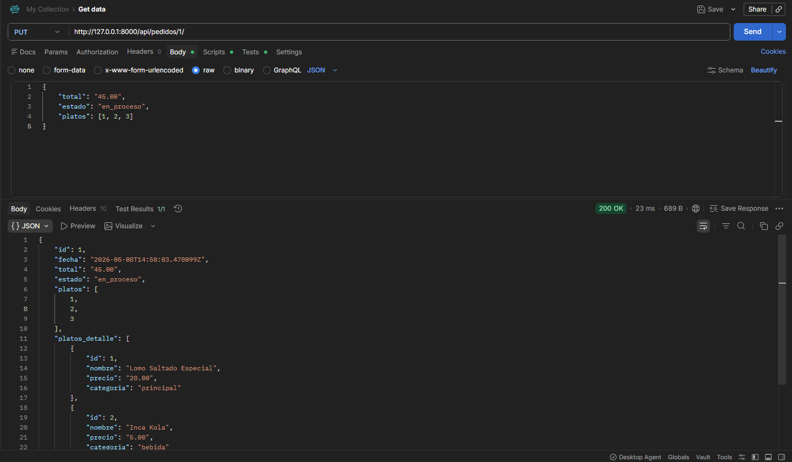
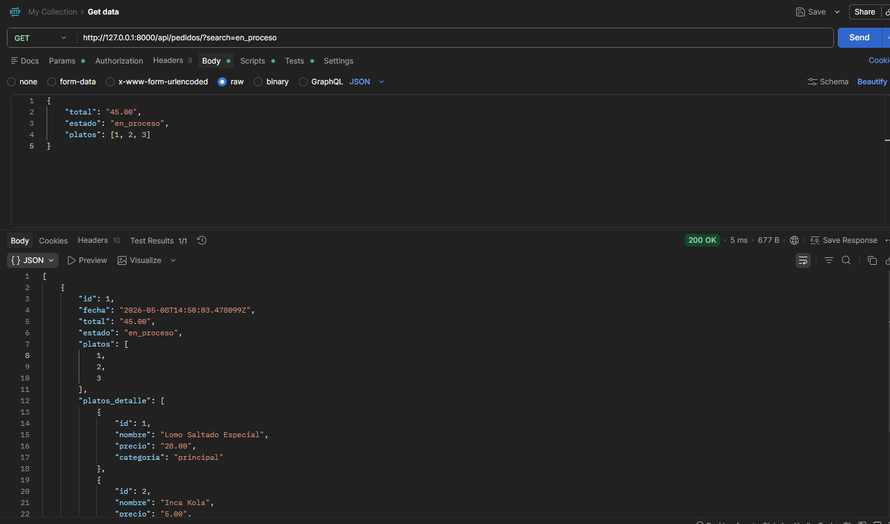
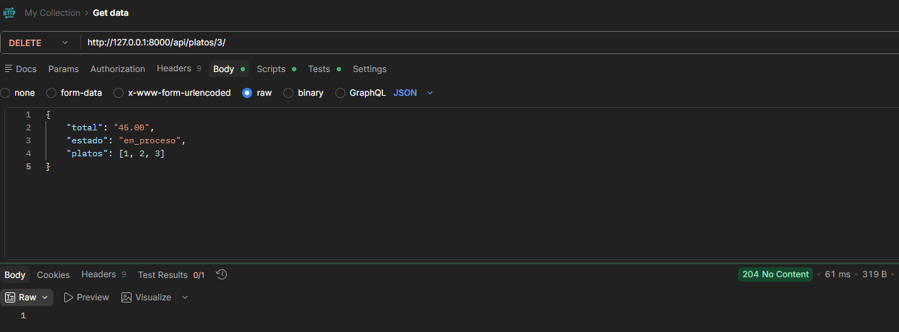
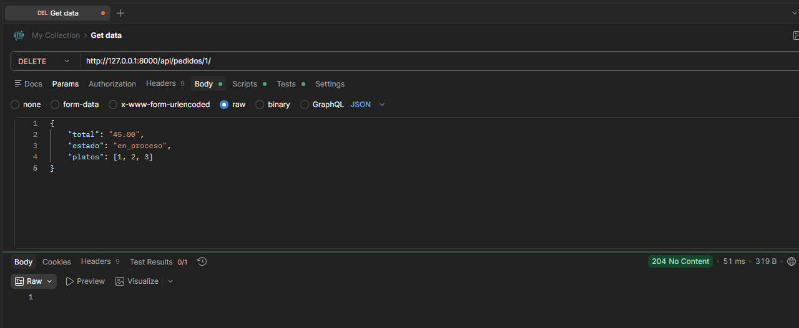

# 🍔 FoodOrder API

API REST para la gestión de restaurante: administración de menús y pedidos de clientes.

## 🛠️ Tecnologías
- Python 3.x
- Django 6.0.5
- Django REST Framework

## ▶️ Instrucciones para ejecutar

```bash
git clone https://github.com/JasonGomezzz/foodorder_api.git
cd foodorder_api
python -m venv venv
venv\Scripts\activate
pip install -r requirements.txt
python manage.py migrate
python manage.py runserver
```

## 📡 Endpoints disponibles

### 🥘 Platos

| Método | Endpoint | Descripción |
|--------|----------|-------------|
| GET | `/api/platos/` | Lista todos los platos |
| POST | `/api/platos/` | Crea un nuevo plato |
| PUT | `/api/platos/{id}/` | Actualiza un plato existente |
| DELETE | `/api/platos/{id}/` | Elimina un plato |
| GET | `/api/platos/?search=postre` | Busca platos por nombre o categoría |

### 🧾 Pedidos

| Método | Endpoint | Descripción |
|--------|----------|-------------|
| GET | `/api/pedidos/` | Lista todos los pedidos con platos anidados |
| POST | `/api/pedidos/` | Crea un nuevo pedido |
| PUT | `/api/pedidos/{id}/` | Actualiza un pedido existente |
| DELETE | `/api/pedidos/{id}/` | Elimina un pedido |
| GET | `/api/pedidos/?search=pendiente` | Busca pedidos por estado |

---

## 📸 Evidencia de endpoints

### ➕ 1. Crear Plato — POST /api/platos/
```json
{
    "nombre": "Lomo Saltado",
    "precio": "25.00",
    "categoria": "principal"
}
```


---

### 📃 2. Listar Platos — GET /api/platos/


---

### ✏️ 3. Editar Plato — PUT /api/platos/1/
```json
{
    "nombre": "Lomo Saltado Especial",
    "precio": "28.00",
    "categoria": "principal"
}
```


---

### 🔍 4. Buscar Plato — GET /api/platos/?search=postre


---

### ➕ 5. Crear Pedido — POST /api/pedidos/
```json
{
    "total": "30.00",
    "estado": "pendiente",
    "platos": [1, 2]
}
```


---

### 📃 6. Listar Pedidos — GET /api/pedidos/
Muestra la relación con los platos anidados **(punto extra ✨)**


---

### ✏️ 7. Editar Pedido — PUT /api/pedidos/1/
```json
{
    "total": "45.00",
    "estado": "en_proceso",
    "platos": [1, 2, 3]
}
```


---

### 🔍 8. Buscar Pedido — GET /api/pedidos/?search=en_proceso


---

### ❌ 9. Eliminar Plato — DELETE /api/platos/3/


---

### ❌ 10. Eliminar Pedido — DELETE /api/pedidos/1/
